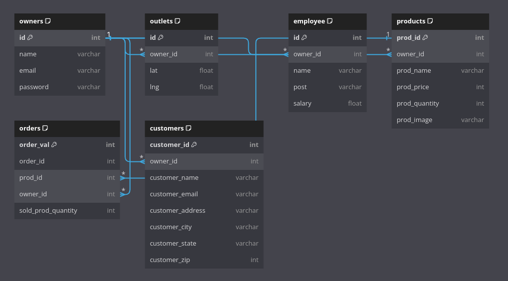
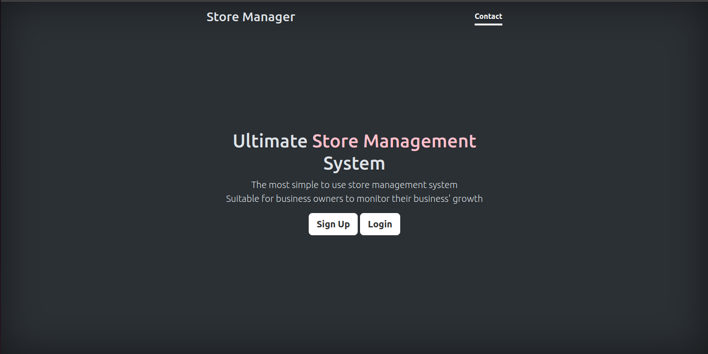
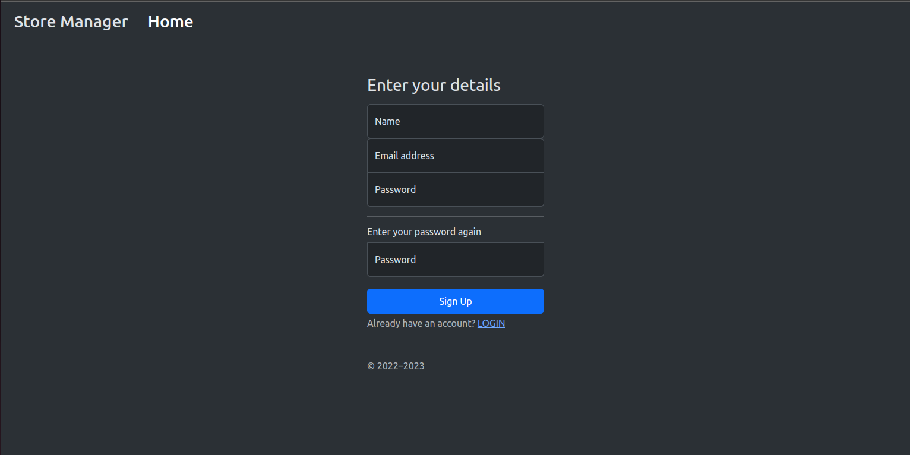
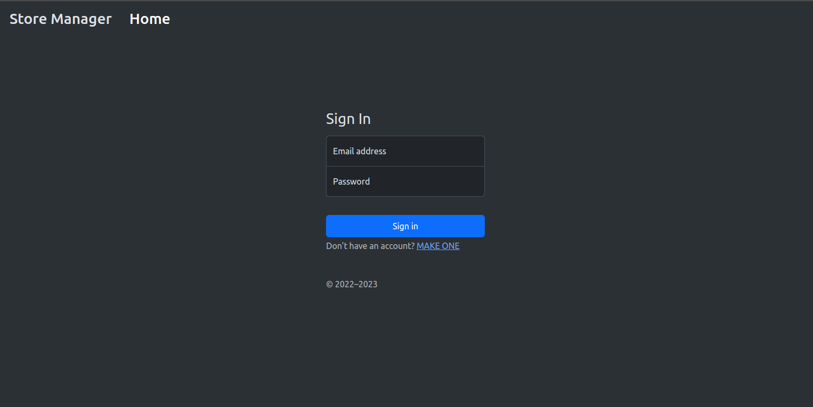
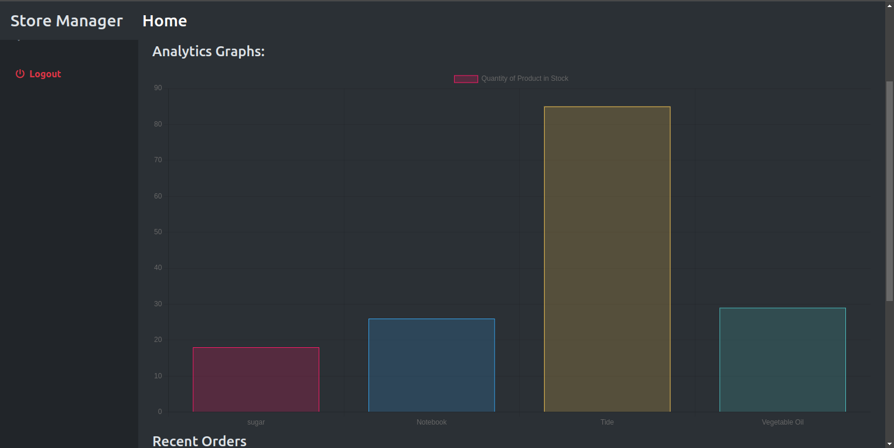
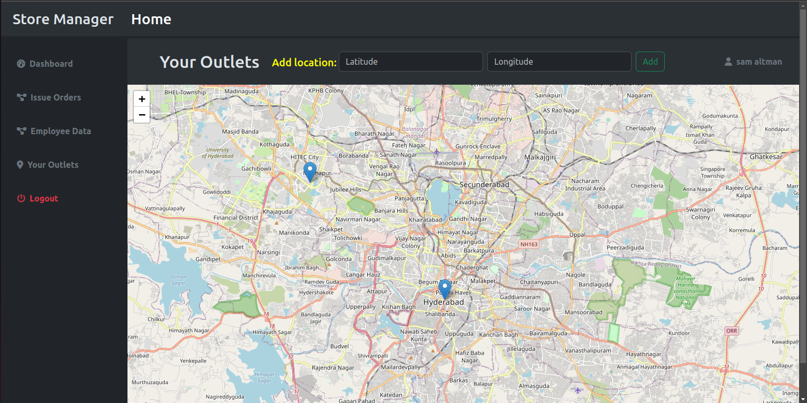
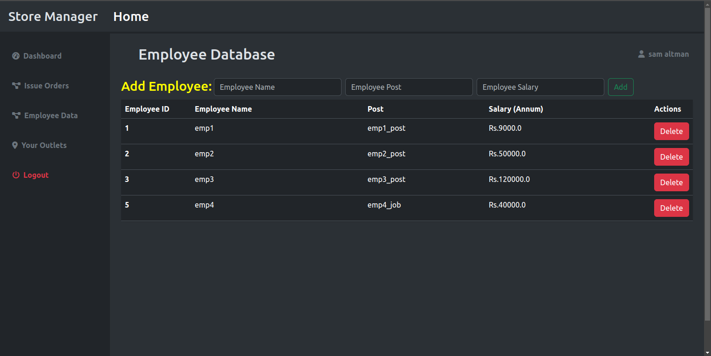

# Store-Management-System

The Store Management System is a robust and user-friendly web application designed to simplify the complexities of managing a store's inventory, sales, and customer interactions. Built using Python's Flask framework and enhanced with Bootstrap for front-end design, it provides a one-stop solution for store owners to track and optimize their business operations. The application also leverages databases to store product details, customer data, and sales transactions, making it an all-inclusive platform for small to medium-sized businesses.

### Key Features:

**User Authentication**: Secure login and sign-up functionalities. \
**Inventory Management**: Real-time tracking of products. \
**Sales Analytics**: Dashboard featuring essential sales KPIs. \
**Order Management**: Seamless handling of customer orders. \
**Customer Database**: Keep track of customer information.

### Target Users:

* Small to medium business owners 
* Inventory managers 
* Sales analysts

### Tech Stack:

**Backend**: Python (Flask) \
**Frontend**: HTML, CSS (Bootstrap), JavaScript (jQuery, AJAX) \
**Data-Visualization**: ChartJs \
**Database**: SQLAlchemy, MySQL \
**Other Libraries**: bcrypt, python poetry

# Installation

### Prerequisites
* Python 3.x installed.
* MySQL Server up and running.

### 1. Clone Repo

```commandline
git clone https://github.com/shubh220922/Store-Management-System.git
cd store-management-system
```

### 2. Install Poetry

```commandline
pip install poetry
```

### 3. Activate Virtual Environment and Install Dependencies

```commandline
poetry install
poetry update
poetry shell
```

Note: create a `.env` file with the `DB_STRING` to connect to your own database


### 4. Run Application

```commandline
python server.py
```

### To run the application using Docker

Save the following file locally:
```yaml
version: '3'
services:
  # Define the app service
  app:
    image: shubh220922/my-store-app
    ports:
      - "5000:5000"  
    depends_on:
      db:
        condition: service_healthy
    environment:
      DB_HOST: db  
      DB_USER: user  
      DB_PASSWORD: user_password  
      DB_NAME: store_db  
  
  # Define the db service
  db:
    image: mysql:8.0.34
    environment:
      MYSQL_ROOT_PASSWORD: root_password
      MYSQL_DATABASE: store_db
      MYSQL_USER: user
      MYSQL_PASSWORD: user_password
    healthcheck:
      test: ["CMD", "mysqladmin", "ping", "-h", "localhost"]
      interval: 10s
      timeout: 5s
      retries: 5
```

In the same directory run the following command and the website will run through docker:
```commandline
sudo docker compose up
```

# Database Schema



# Screenshots

### 1. Home Page


### 2. Sign Up and Sign In pages
Sign Up"

Sign In:


### 3. Dashboard feature


### 4. Outlet management feature


### 5. Employee management feature



